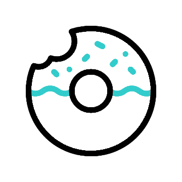
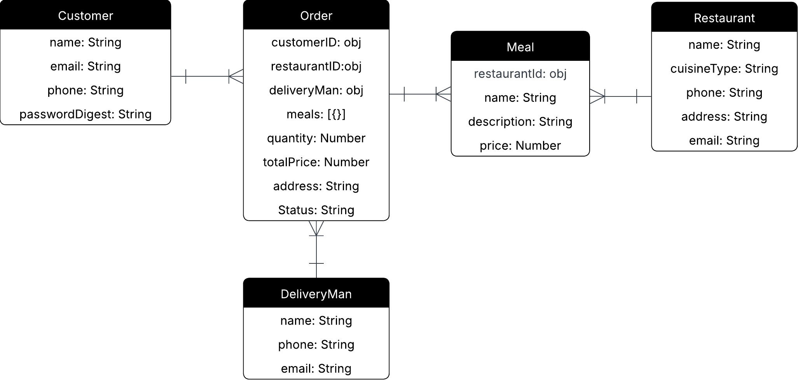
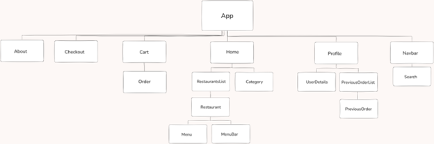

<h1>
  
  Cat-ch It!
</h1>

**Date** Aug / 06 / 2025  
**Developed By**  [Kawthar Mohammad](https://github.com/Kawthara-M) | [Yara Ismaeel ](https://github.com/Yara-Waleed) | [Fatima Albasri](https://github.com/fatemaAlbasri)

## Description
Luqma, a matchmaking platform connecting customers, resturants, and delivery in one platform. Inspired by platforms like Talabat & Jahez, Luqma aims to streamline the food ordering experience from browsing to doorstep delivery.
 

  

## Getting Started

A first step for Luqma project to say the light was planning, a critical step to guide development. It mainly resulted in:

- **Entity Relationship Diagram (ERD)**: the main guide of schema and database managment.  

  

- **Component Hierarchy Diagram**: the cornerstone of building the frontend, designed with Excalidraw.  

  

- **Collaborative Board**: A board shared among team memebers to assign tasks and track prograss. | 
[Notion]() |

Following the planning, the development has mainly resulted in 2 main outcomes, a front-end and a backend developed and connected using the MERN Stack (MongoDB, Express, React, Node.js).  

| [Luqma Deployed Version]() |

## Technologies Used
- MongoDB
- Express
- React
- Node.js

## User Stories

## Wireframes
**w1**

---
### **Future Enhancements**

---
### **Credits**

---
